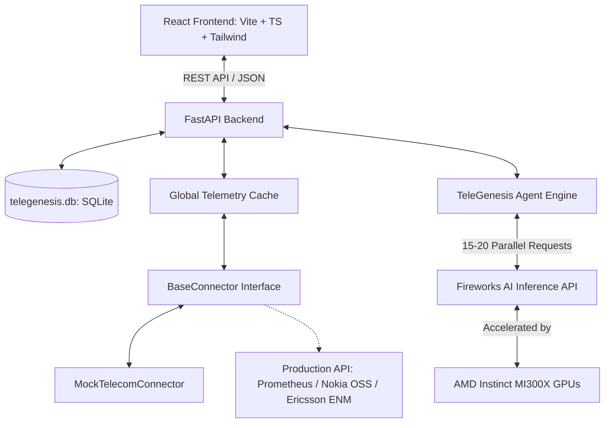
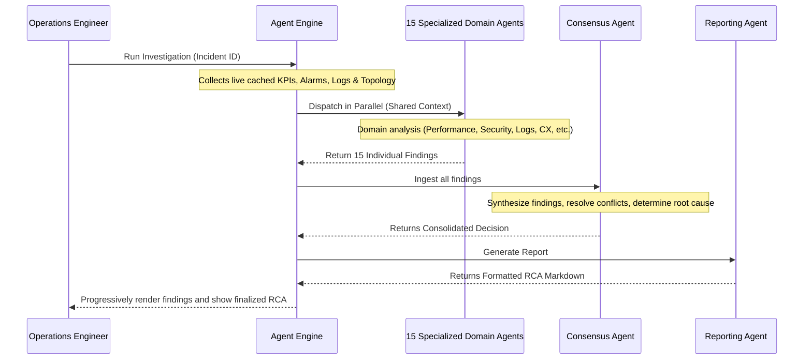

# TeleGenesis OS — Architecture, Multi-Agent AI & AMD Integration Guide

This document provides a detailed walkthrough of **TeleGenesis OS** for AMD evaluators and judges. It explains the system's data architecture, how the multi-agent AI system functions in parallel, and how the platform leverages **AMD Instinct™ MI300X GPU acceleration** through our integration with **Fireworks AI**.

---

## 1. System Architecture & Data Layer

TeleGenesis OS is a high-performance, vendor-neutral telecom operations platform built using a modern decoupled architecture.



### The Pluggable Data Layer
At the core of the platform is a plug-in data model that decouples telecom data sources from the AI and UI layers:
* **The Interface (`BaseConnector`)**: Defines abstract methods for collecting real-time network states (KPIs, alarms, topology, traffic flows, and logs).
* **The Current Implementation (`MockTelecomConnector`)**: Simulates a live metro-scale network of 27 nodes (Data Centers, Core Routers, Aggregation Switches, Cell Towers) and 30 fiber trunk links across 3 geographic regions (North, South, East).
* **Diurnal Telemetry Modeling**: Data is not statically generated. Metrics like throughput, latency, and packet loss follow mathematical sine-wave diurnal curves (network traffic peaks at noon, drops at 3 AM).
* **Cascading Failure Simulations**: When an incident occurs, the connector models realistic network failure propagation (e.g., CRC errors -> OSPF protocol flaps -> link rerouting -> aggregate link congestion -> packet loss).

### Global Telemetry Synchronization
To ensure that all pages (Executive Dashboard, AI Operations Center, TeleTAC War Room, Settings) display identical metric values, alarm counts, and topologies at any given moment, the backend uses a centralized **Telemetry Cache**. This cache keeps all instances of the connector synchronized and updates the snapshot atomically every 15 seconds.

---

## 2. How the AI Agents Work (TeleGenesis Multi-Agent System)

When a critical incident occurs (such as a fiber cut or aggregate-switch congestion), TeleGenesis OS does not use a single general-purpose chatbot. Instead, it dispatches a specialized team of **15 AI agents** orchestrated by our **Agent Engine**.



### The Agent Directory
Each agent is a modular prompt specialist operating within a parallel workflow pipeline:

| Phase | Agent Name | Domain Focus / Role |
| :--- | :--- | :--- |
| **Phase 1** | **Performance Agent** | Analyzes metric history (throughput drops, latency spikes, packet loss patterns). |
| | **Alarm Correlation Agent** | Correlates alarms across multiple layers (physical, transport, application). |
| **Phase 2** | **Log Analysis Agent** | Scans equipment logs (OSPF adjacency resets, BGP session drops) for error signatures. |
| | **Configuration Agent** | Identifies configuration changes, interface state mismatches, or firmware anomalies. |
| | **Security Agent** | Evaluates metrics for DDoS, unauthorized config access, or security intrusions. |
| **Phase 3** | **Customer Experience Agent** | Estimates subscriber impact (QoE degradation, call setups, setup failures). |
| | **Cost Optimization Agent** | Calculates CAPEX/OPEX cost impact of hardware upgrades vs. software configurations. |
| | **Knowledge Agent** | Performs semantic searches over historical resolution playbooks. |
| **Phase 4** | **Traffic Engineering Agent** | Recommends paths, QoS policing, or routing configuration adjustments (e.g., ECMP). |
| | **Capacity Planning Agent** | Forecasts link exhaustion thresholds based on current usage trends. |
| | **Energy Optimization Agent** | Optimizes power allocation for cell sectors and nodes during off-peak hours. |
| **Phase 5**| **Consensus Agent** | Aggregates all 11 preceding findings, resolves discrepancies, and selects the final root cause. |
| **Phase 6**| **Reporting Agent** | Compiles the findings into a telemetry-backed, clean Root Cause Analysis (RCA) report. |

---

## 3. AMD Integration & Acceleration via Fireworks AI

While the FastAPI backend and React frontend are hosted locally during this demonstration, **every single AI agent request is accelerated by AMD hardware**.

### The Fireworks AI and AMD Connection
TeleGenesis OS routes all agent inference calls to the **Fireworks AI API**, using the ultra-fast and highly accurate **DeepSeek-V4-Pro** (primary reasoning model) and **GLM 5.2 / glm-5p2** (fast agent model) as configured in the `.env` file. 

Fireworks AI runs their advanced, ultra-low-latency inference engines in partnership with AMD, powering their entire model catalog (including DeepSeek, GLM, and Llama models) directly on **AMD Instinct™ MI300X GPU accelerators**.

```
[TeleGenesis Agents] 
       │ (15 parallel API calls for GLM 5.2 / DeepSeek-V4-Pro)
       ▼
[Fireworks AI API Gateway]
       │
┌────────────────────────────────────────────────────────┐
│  AMD Instinct™ MI300X GPU Acceleration Cluster        │
│                                                        │
│  - 192GB HBM3 Memory (5.3 TB/s bandwidth per GPU)     │
│  - Parallel execution of GLM & DeepSeek model streams  │
│  - Real-time token generation via optimized ROCm stack │
└────────────────────────────────────────────────────────┘
```

### Why AMD Instinct™ MI300X is Critical to this System:

1. **Ultra-Low Latency for Parallel Workflows**:
   An incident investigation initiates **15 separate AI calls in parallel**. On standard hardware clusters, these concurrent requests would experience queue delays, lagging the UI. The **AMD Instinct MI300X** features **192GB of HBM3 memory** and **5.3 TB/s of memory bandwidth**, enabling Fireworks AI to process all 15 agents concurrently in a single batch, delivering full results to the frontend within seconds.
   
2. **High-Throughput Token Generation**:
   A single run of the investigation pipeline transmits and generates between **10,000 and 15,000 tokens** (incorporating network topologies, logs, and agent summaries). The massive computational density of AMD Instinct GPUs allows Fireworks AI to output these tokens at industry-leading speeds (exceeding 100 tokens/second per stream).

3. **Energy & Operational Efficiency**:
   By using Fireworks AI's AMD-backed serverless inference endpoint, TeleGenesis OS provides enterprise-tier, multi-agent AI operations without requiring local server clusters, significantly reducing local carbon footprints and hardware overhead.

---

## 4. Demonstrating the System (RCA and Digital Twin)

To verify the system's live capabilities, reviewers can execute the following steps in the application:

1. **Observe Synchronized Telemetry**: Open the **Executive Dashboard** and note the Active Alarms and KPI values. Navigate to the **AI Operations Center** or **TeleTAC War Room** — you will see the exact same metrics and alarm feeds, proving backend data synchronization.
2. **Trigger an Investigation**: In the **TeleTAC War Room**, select an open incident and click **Run Investigation**. Watch the backend logs to see the parallel Fireworks AI API requests executing. The React frontend will animate each agent's findings as they return.
3. **Analyze the AMD-Powered Consensus**: Scroll to the consensus section to see how the system correlates the Performance, Log, and Alarm outputs into a single, clean markdown RCA report complete with confidence ratings and recommended resolution steps.
4. **Deterministic Simulation (Digital Twin)**: Take the recommended action from the AI (e.g., Bandwidth Upgrade or ECMP routing) and run it in the **Digital Twin**. The simulator calculates the precise, non-uniform improvements in Latency, Packet Loss, and Throughput to validate the fix before it goes live.
